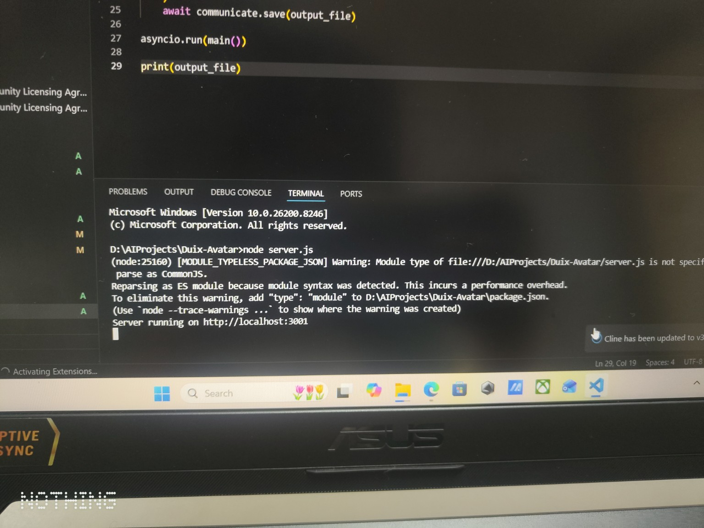
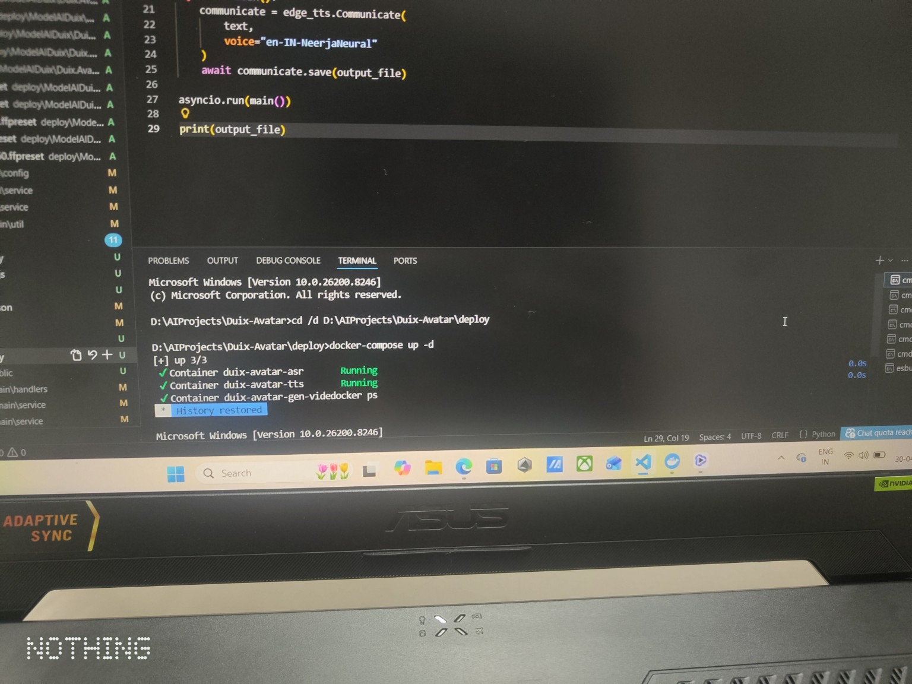
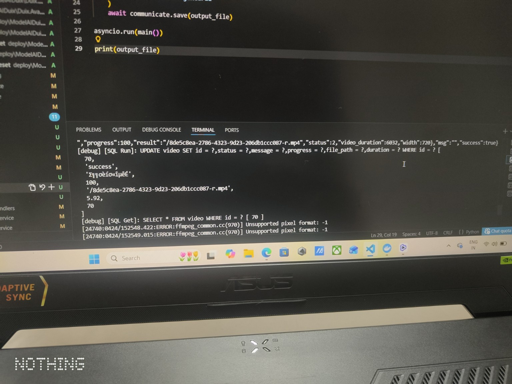

# 🤖 Temi AI Avatar System

A dynamic AI avatar system designed for Temi robot interaction that generates synchronized lip-sync video responses using a near real-time processing pipeline.

This system converts user input into a talking avatar video using a pipeline:
Text → TTS → Audio Wave → Lip Sync → Video Generation

Built using Duix-Avatar as the core engine, extended with a custom backend pipeline and performance optimizations.

---
## Demo Video

Watch the AI Avatar demo here:  
[LinkedIn Demo Video](https://www.linkedin.com/posts/stuti-agrawal-2611nov_ai-generativeai-reactjs-ugcPost-7459865972695425024-3G4R?utm_source=share&utm_medium=member_android&rcm=ACoAADMfGVcB5z1GPj6Kl3z4OXL7C7hoYUXcDMU)
---

## 🚀 What I Built

* Integrated Duix Avatar for lip-sync video generation
* Built backend pipeline using Node.js
* Deployed services using Docker
* Achieved ~30–40 seconds end-to-end avatar response generation
* Executed complete end-to-end pipeline from user input to avatar video output
* Tested near real-time feasibility for Temi robot interaction

---

## 🧠 System Flow

User Input → Text Processing → TTS (Audio Wave Generation) → Avatar Lip Sync → Video Rendering → Final Video Output

---

## 📸 Proof of Work

### Backend Running

### Docker Running

### Pipeline Execution

### Video Output

---

## 🛠️ Tech Stack

* Node.js
* Python
* Docker
* Duix Avatar
* FFmpeg

---

## 🎯 Use Case

* Hospital assistant (Temi robot)
* AI-based interactive avatar system

  ## ✨ Features

- Near Real-time text-to-speech (TTS)
- Audio wave generation
- Avatar lip-sync rendering
- Video generation pipeline
- Docker-based deployment
- End-to-end working system

## ⚡ Key Highlight

- Optimized avatar generation pipeline to reduce response latency
- Built working end-to-end system from TTS to video output

## ⚡ Implementation Note

This project leverages the Duix-Avatar open-source framework for avatar video generation.
On top of it, I implemented:
- Custom API-based triggering using Node.js
- End-to-end pipeline (Text → TTS → Lip Sync → Video)
- Reduced avatar response latency by optimizing pipeline execution
- Integration-ready backend for Temi robot use-case

## 👩‍💻 Author

Stuti Agrawal
